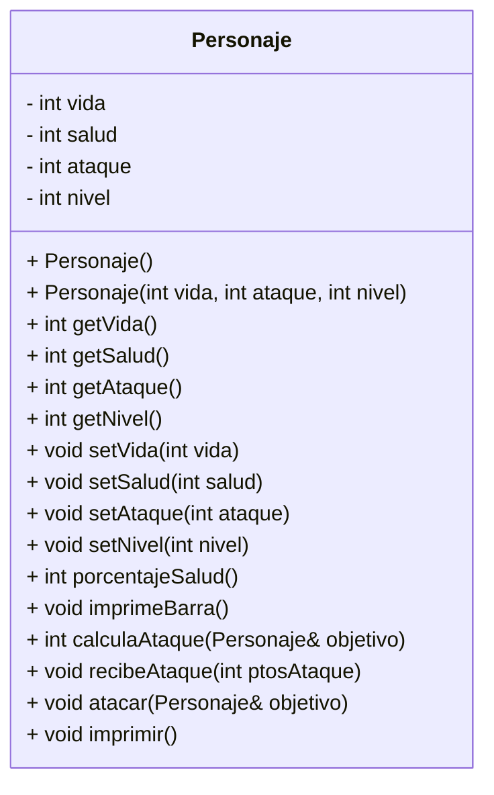

# UML

```mermaid
classDiagram
    class Personaje {
        - int vida
        - int salud
        - int ataque
        - int nivel

        + Personaje()
        + Personaje(int vida, int ataque, int nivel)

        + int getVida()
        + int getSalud()
        + int getAtaque()
        + int getNivel()

        + void setVida(int vida)
        + void setSalud(int salud)
        + void setAtaque(int ataque)
        + void setNivel(int nivel)

        + int porcentajeSalud()
        + void imprimeBarra()
        + int calculaAtaque(Personaje& objetivo)
        + void recibeAtaque(int ptosAtaque)
        + void atacar(Personaje& objetivo)
        + void imprimir()
    }
```
