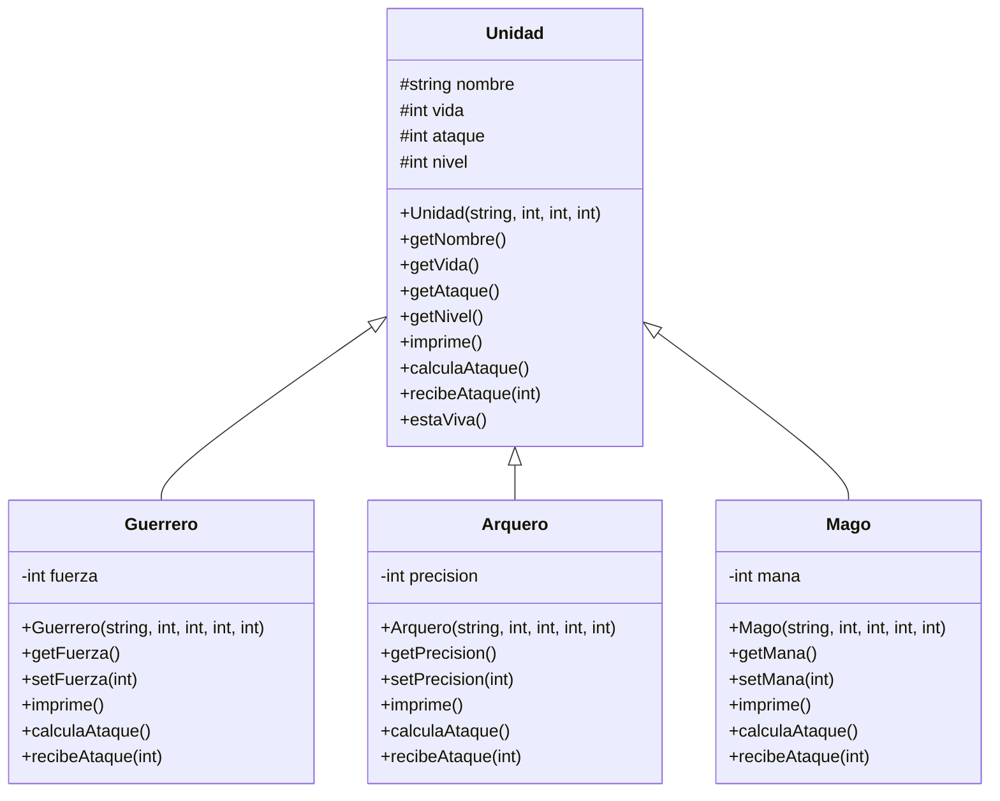

# Avance de Proyecto: Herencia

## UML de clases

## Descripción de reglas

La clase `Unidad` representa una unidad base con nombre, vida, ataque y nivel. Sus métodos principales son `imprime`, `calculaAtaque` y `recibeAtaque`.

La clase `Guerrero` hereda de `Unidad` y agrega el atributo `fuerza`. Su ataque aumenta dependiendo de su fuerza, y al recibir daño puede reducir parte del daño recibido.

La clase `Arquero` hereda de `Unidad` y agrega el atributo `precision`. Su ataque mejora cuando tiene mayor precisión, y también puede reducir un poco el daño recibido al intentar esquivar.

La clase `Mago` hereda de `Unidad` y agrega el atributo `mana`. Su ataque puede aumentar usando maná, y también puede usar maná para protegerse y recibir menos daño.